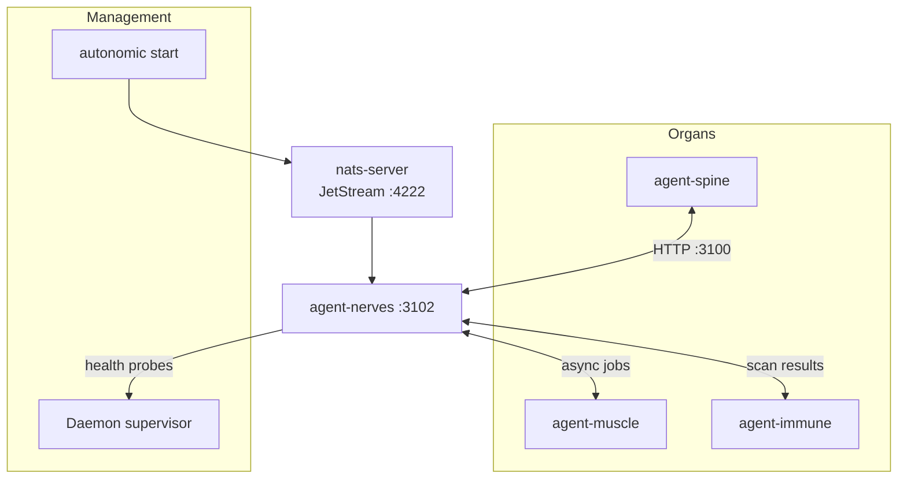

# agent-nerves — Distributed Event Bus for the Autonomic Ecosystem

**Cloud-Native role: Service mesh** (Istio / Linkerd analog) — NATS JetStream connectivity, stream bootstrap, and event routing.

`agent-nerves` is the **service mesh** for Autonomic. It connects isolated daemons to a shared NATS JetStream message broker, bootstraps the `AUTONOMIC` stream, and exposes health and management APIs. 
Every piece of async communication—compute jobs destined for `agent-muscle`, security scan results from `agent-immune`, or state transitions from `agent-spine`—flows through the NATS broker.

---

## Under the Hood: How it Works

A multi-agent system needs asynchronous, event-driven communication. Without it, every API call blocks until a response arrives, and a single timeout cascades into a system failure. 
Autonomic uses **NATS JetStream** to provide durable, at-least-once delivery with wildcard subject routing. However, configuring, bootstrapping, and operating a raw NATS broker is a massive ops burden for developers.

`agent-nerves` acts as a management wrapper around NATS that:

1. **Auto-Bootstraps JetStream:** On startup, it connects to NATS and automatically configures the `AUTONOMIC` stream with the correct retention policies and replica limits.
2. **Abstracts Topology:** The other daemons don't need to know how to configure JetStream streams; they just connect and publish to simple NATS subjects.
3. **Resilience:** It manages reconnections with exponential backoff if the NATS broker crashes or is restarted.
4. **WASM Filtering:** Supports dynamic event filtering (JSON rules + WASM) to drop invalid messages before they hit the stream.
5. **Multi-Node Clusters:** Generates cluster configurations for distributed deployments across multiple physical machines.



**Start order:** `autonomic start` launches `nats-server -js -m 8222` first, then `agent-nerves serve` on `:3102`, then `agent-heart serve`. This ensures the message bus is available before any organ tries to publish.

---

## Standalone vs Integrated

| Mode | What you type | What happens |
|------|--------------|--------------|
| **Standalone** | `agent-nerves serve` | Daemon on `:3102`, connects to NATS, bootstraps stream |
| **Standalone** | `agent-nerves ping` | Test NATS connectivity (useful for diagnostics) |
| **Standalone** | `agent-nerves stream tail` | Tail `autonomic.>` subjects from CLI |
| **Integrated** | `autonomic start` | NATS → nerves started in order by supervisor |
| **Integrated** | All organs | Publish/subscribe via nerves HTTP API or NATS directly |
| **Integrated** | Cluster mode | Multi-node WireGuard-based NATS route configuration |

In standalone mode, nerves serves as a NATS management CLI with stream inspection and ping diagnostics. In integrated mode, it's the async backbone — every organ publishes and subscribes through its APIs.

---

## Why agent-nerves?

| Problem | agent-nerves answer |
|---------|-------------------|
| Organs can't communicate asynchronously | **JetStream** — durable subjects (`autonomic.compute.job`, `autonomic.scan.result`, etc.) |
| NATS operations are additional ops burden | **`autonomic start`** installs and supervises `nats-server` automatically |
| No visibility into what's on the bus | **`stream tail`** — inspect `AUTONOMIC` stream subjects from CLI |
| Multi-machine agent deployments are hard | **Cluster config** — route files and WireGuard-ready templates |
| Filtering messages requires custom code | **Event filters** — JSON rules and WASM modules for selective routing |

---

## What you get

| Feature | Why use it |
|---------|------------|
| **JetStream bootstrap** | `serve` creates the `AUTONOMIC` stream — no manual NATS admin |
| **Connectivity probe** | `ping` — fail fast when NATS broker is down |
| **Stream inspection** | `stream tail` — debug async jobs without a GUI |
| **Event filters** | JSON rules or WASM modules evaluated before message publish |
| **Cluster tooling** | Multi-node NATS route generation with WireGuard templates |
| **Embedded fallback** | Config `[nerves.nats]` — dev laptop runs without external NATS |
| **Health endpoints** | `GET /health`, `POST /nats/ping` — supervisor and integration probes |

---

## Commands

| Command | Description |
|---------|-------------|
| `agent-nerves serve` | HTTP daemon; connects to NATS (embedded fallback if unreachable) |
| `agent-nerves ping` | Test NATS connectivity and latency |
| `agent-nerves status` | Show config, broker URL, cluster state, filter registry |
| `agent-nerves stream tail` | Tail JetStream messages on `autonomic.>` subjects |
| `agent-nerves cluster init\|status\|render-config` | Multi-node NATS route configuration |
| `agent-nerves filter list\|test` | Manage JSON/WASM event filters |

Global `--progress` (or `AGENT_PROGRESS=1`) enables structured ProgressTree CLI output.

---

## HTTP API

| Method | Endpoint | Description |
|--------|----------|-------------|
| `GET` | `/health` | Daemon health and uptime |
| `POST` | `/nats/ping` | NATS connectivity check |
| `GET` | `/jetstream/status` | `AUTONOMIC` stream readiness |
| `GET` | `/cluster/status` | Cluster topology and WireGuard status |
| `POST` | `/filter/test` | Evaluate filter rules against a message |

---

## Quick Install

```bash
curl -fsSL https://raw.githubusercontent.com/autonomic-ai-dev/agent-nerves/master/scripts/install.sh | bash

# Recommended — includes nats-server:
curl -fsSL https://raw.githubusercontent.com/autonomic-ai-dev/agent-body/master/scripts/install-all-organs.sh | bash
export PATH="$HOME/.local/bin:$PATH"
autonomic start
```

Verify:
```bash
agent-nerves status
agent-nerves ping
```

---

## Configuration

Section `[nerves]` in `~/.autonomic/config.toml` (default port **3102**).

| Path | Purpose |
|------|---------|
| `~/.autonomic/state/nerves/` | Cluster state and runtime data |
| `~/.autonomic/filters/` | Event filter rules (JSON + WASM) |
| `~/.autonomic/broker/` | NATS JetStream persistence |

---

## Development

```bash
git clone https://github.com/autonomic-ai-dev/agent-nerves.git && cd agent-nerves
cargo build --release -p agent-nerves
cargo build --release -p agent-nerves --features wasm  # WASM event filter support
cargo test --release -p agent-nerves
```

---

## License

MIT
