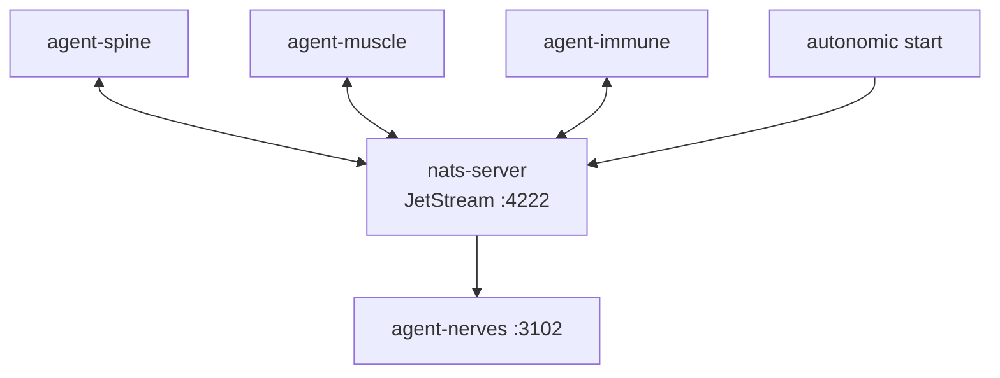

# agent-nerves

**Distributed event bus — NATS connectivity, JetStream, and multi-node cluster coordination.**

Part of the **[Autonomic AI](https://github.com/autonomic-ai-dev/agent-body)** ecosystem. Connects to (or embeds) NATS, bootstraps the shared `AUTONOMIC` JetStream stream, and exposes health APIs for spine, muscle, and immune.

| Standalone | Integrated |
|------------|------------|
| `agent-nerves ping` | Started after `nats-server` via `autonomic start` |
| `agent-nerves serve` on **3102** | Consumed by agent-muscle, agent-spine, agent-immune |
| Embedded NATS fallback | External broker via `AUTONOMIC_NATS_URL` |

---

## Why agent-nerves?

| Problem | agent-nerves answer |
|---------|-------------------|
| Organs can't talk async | **JetStream** — durable subjects (`autonomic.compute.job`, …) |
| NATS ops is extra toil | **`autonomic start`** installs and supervises `nats-server` first |
| No stream visibility | **`stream tail`** — inspect AUTONOMIC stream from CLI |
| Multi-machine agents | **Cluster config** — route files and WireGuard-ready templates |



**Start order:** `install-all-organs.sh` installs `nats-server` to `~/.local/bin`. Run `autonomic start` to launch `nats-server -js -m 8222`, then `agent-nerves serve`, then `agent-heart serve`.

---

## Quick Install

```bash
curl -fsSL https://raw.githubusercontent.com/autonomic-ai-dev/agent-nerves/master/scripts/install.sh | bash
# recommended — includes nats-server:
curl -fsSL https://raw.githubusercontent.com/autonomic-ai-dev/agent-body/master/scripts/install-all-organs.sh | bash
export PATH="$HOME/.local/bin:$PATH"
autonomic start
```

Verify:

```bash
agent-nerves status
agent-nerves ping
export AUTONOMIC_NATS_URL=nats://localhost:4222
```

---

## Main features

| Feature | Setup | Why use it |
|---------|-------|------------|
| **JetStream bootstrap** | `serve` | Creates `AUTONOMIC` stream for the organism |
| **Connectivity probe** | `ping` | Fail fast when broker is down |
| **Stream tail** | `stream tail` | Debug async jobs without a GUI |
| **Event filters** | `filter list/test` | JSON/WASM rules before publish |
| **Cluster tooling** | `cluster init/status` | Multi-node NATS route generation |
| **Embedded fallback** | config `[nerves.nats]` | Dev laptop without external NATS |

---

## Commands

| Command | Description |
|---------|-------------|
| `serve` | HTTP daemon; connects to NATS (embedded if unreachable) |
| `ping` | Test NATS connectivity |
| `status` | Config and broker paths |
| `stream tail` | Tail JetStream on `autonomic.>` |
| `cluster init\|status\|render-config` | Multi-node NATS route config |
| `filter list\|test` | JSON / WASM event filters |

---

## HTTP API

| Endpoint | Description |
|----------|-------------|
| `GET /health` | Daemon health |
| `POST /nats/ping` | NATS connectivity check |
| `GET /jetstream/status` | AUTONOMIC stream readiness |
| `GET /cluster/status` | Cluster / WireGuard status |
| `POST /filter/test` | Evaluate filter rules |

---

## Configuration

Section `[nerves]` in `~/.autonomic/config.toml` (default port **3102**).

Cluster state: `~/.autonomic/state/nerves/` · Filters: `~/.autonomic/filters/` · Broker data: `~/.autonomic/broker/`

---

## Local setup

```bash
git clone https://github.com/autonomic-ai-dev/agent-nerves.git && cd agent-nerves
cargo build --release -p agent-nerves
# start broker stack from agent-body checkout:
autonomic start
agent-nerves ping
```

---

## Development

```bash
cargo test --release -p agent-nerves
cargo build --release -p agent-nerves --features wasm   # WASM filters
```

---

## License

MIT
